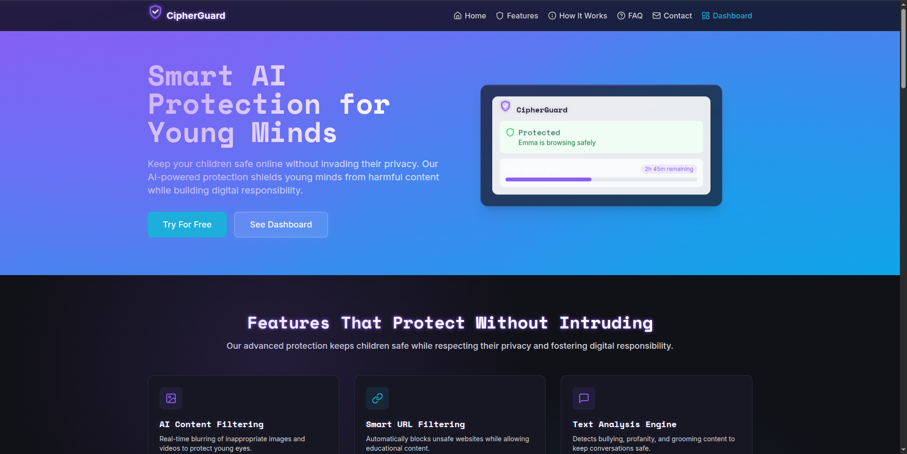
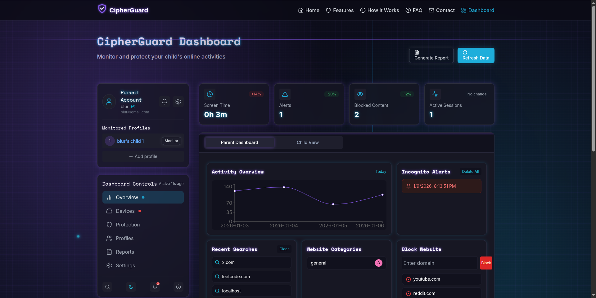
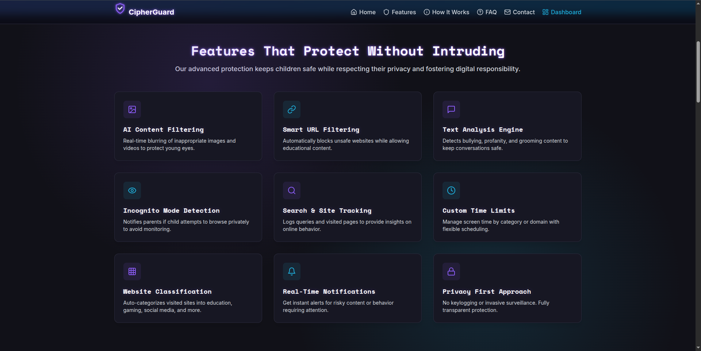
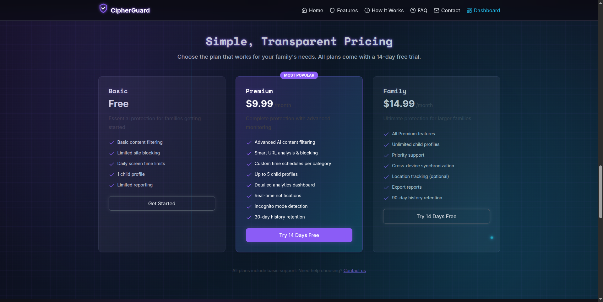
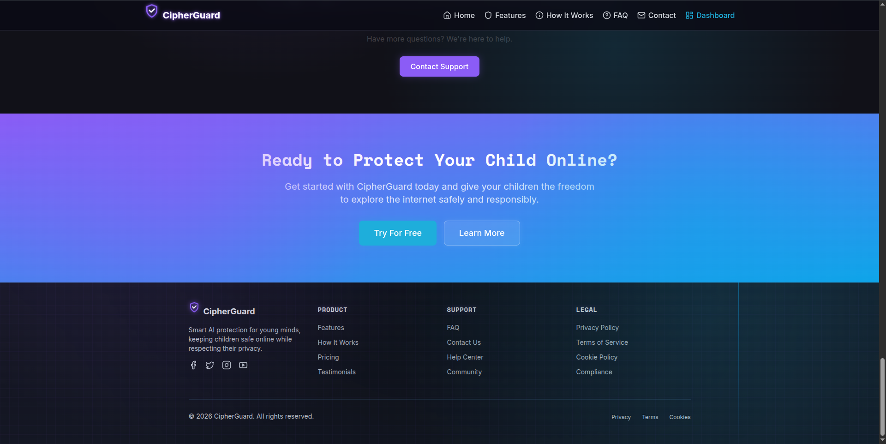

# CipherGuard

CipherGuard is a full-stack parental-control platform consisting of a browser-based dashboard and a Node.js/Express API backed by MongoDB. It enables parents to monitor, manage, and protect their children’s online activity across devices through real-time monitoring, URL blocking, and incognito alerts.

This repository is a monorepo with separate frontend and backend applications:

- `frontend/` – React + TypeScript + Vite + Tailwind + shadcn-ui dashboard.
- `backend/` – Node.js + Express + MongoDB REST API.

> Note: The GitHub repo name `Vihaan8.0` reflects the competition this project was built for; the product itself is **CipherGuard**.

## Key Features

- **User Authentication** – JWT-based parent authentication (signup/login) and protected APIs.
- **Parent Dashboard** – Central dashboard showing parent profile, monitored children, and high-level stats.
- **Child Profiles** – Create and manage multiple child profiles linked to a parent account.
- **Activity Monitoring** – Track per-domain browsing activity and aggregate daily usage statistics.
- **Device & Protection UI** – Simulated device list and protection toggles in the UI for future expansion.
- **Real-time-style Notifications** – UI for alerts and notifications about child activity (backed by real and placeholder data).
- **Reports & Analytics UI** – UI for generating and exporting activity reports.
- **Responsive UI** – Tailwind-based layout optimized for desktop and mobile.

## Screenshots

- landing Page


- Dashboard


- Other landing pages







## Tech Stack

**Frontend**
- React 18, TypeScript
- Vite
- Tailwind CSS + shadcn-ui components
- React Router DOM
- React Query (@tanstack/react-query)
- Recharts for charts
- Lucide icons, custom toast hook

**Backend**
- Node.js + Express
- MongoDB with Mongoose
- JWT authentication (jsonwebtoken)
- dotenv, cors

## Project Structure

- `backend/` – Express API, Mongoose models, controllers, routes, and auth middleware.
- `frontend/` – Vite React app with pages, components, UI primitives, and hooks.
- `WARP.md` – Agent guidance and architecture notes for this repo.

Refer to `frontend/README.md` and `backend/README.md` for directory-specific details.

## Getting Started

### Prerequisites

- Node.js and npm installed
- A running MongoDB instance (local or hosted)

### Install Dependencies

From the repo root:

```sh
cd backend
npm install

cd ../frontend
npm install
```

### Environment Configuration

Create `backend/.env`:

```sh
MONGO_URI="<your-mongodb-connection-uri>"
JWT_SECRET="<jwt-signing-secret>"
PORT=5000 # optional, defaults to 5000
```

Create `frontend/.env`:

```sh
VITE_BACKENDURL="http://localhost:5000" # or your deployed backend URL
```

### Running in Development

Start the backend API:

```sh
cd backend
npm run dev
```

Start the frontend dashboard (in another terminal):

```sh
cd frontend
npm run dev
```

The backend listens on `PORT` (default `5000`). Vite will serve the frontend (by default on `5173`).

### Building for Production

Build the frontend production bundle:

```sh
cd frontend
npm run build
```

You can then serve the built frontend from any static host, configured to talk to a running instance of the backend API.

> There are no automated tests configured yet. `npm test` in `backend/` is a placeholder and will exit with a non-zero status.

## High-Level Architecture

### Backend API

- Entry point: `backend/server.js`.
- Configures CORS for local dev, ngrok tunnels, and Chrome extensions.
- Connects to MongoDB via `mongoose.connect(MONGO_URI)` and mounts feature routers:
  - `/api/auth` – parent signup/login and current user endpoint.
  - `/api/parent` – parent-facing APIs to list and manage children.
  - `/api/child` – child-centric stats and filtered web-usage endpoints.
  - `/api/monitor` – monitoring endpoints used by extensions/clients to send URL activity and incognito alerts.

Core models:

- `Parent` – name, email, password (currently plain text), and list of child references.
- `Child` – email, name, extension token, blocked URLs, monitored URLs with a per-day time-spent map, and incognito alerts.

### Frontend Dashboard

- Entry point: `frontend/src/main.tsx` rendering `App`.
- `App.tsx` sets up React Query, tooltip and toast providers, and routing via `react-router-dom`:
  - `/` – marketing landing page (`Index`).
  - `/dashboard` – main parent dashboard (`Dashboard`).
  - `/login`, `/signup` – auth pages.
  - `/add-child` – child profile creation.
  - `/contact` and a catch-all `NotFound` route.

Authentication flow:

1. Parent signs up or logs in via `/api/auth/signup` or `/api/auth/login`.
2. Backend returns a JWT which is stored in `localStorage` under `token`.
3. Dashboard and child-management pages read this token and send it as `Authorization: Bearer <token>` in API requests.

The dashboard composes multiple components for stats, charts, activity feeds, device/protection UIs, and report generation. Data is pulled from the backend’s `/api/auth`, `/api/parent`, `/api/child`, and `/api/monitor` endpoints, with some UI-only placeholders ready for future expansion.
